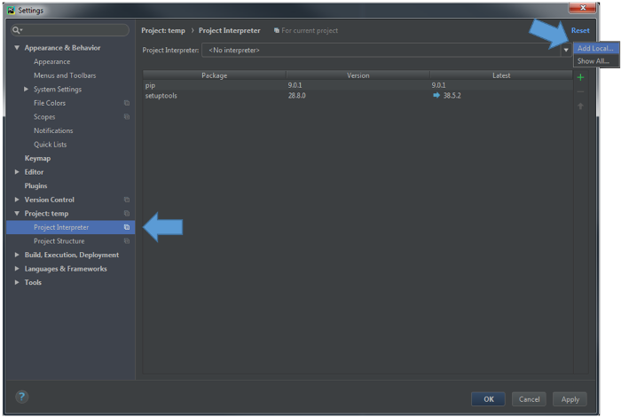
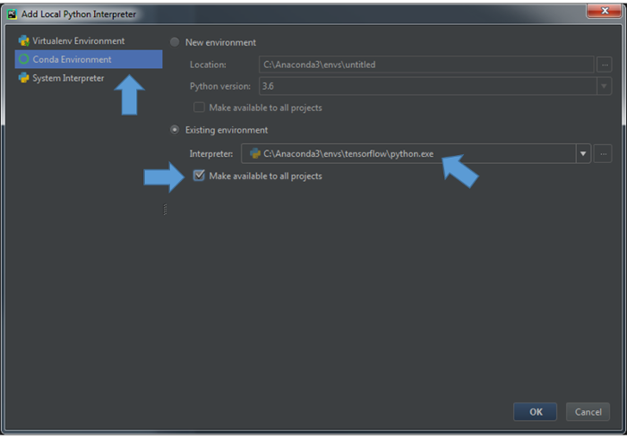

# Install PyCharm:
We believe PyCharm is one of the best (if not the best) IDEs for python programming. It comes with powerfull tools for code editting, navigating, refactoring, debugging and etc. The community version of this software is free and you can download it through https://www.jetbrains.com/pycharm/download/. If you are student, you also can use the professional edition using your university email (read more [here](https://www.jetbrains.com/student/)).

After you download and install the PyCharm. You have to show the PyCharm that where is the location of the python file that you have installed your ```tensorflow``` environment. You can do so through the interpreter section. When you have an existing project opened (if not, create a new project), go to the setting. In project section, select the project interpreter and all local virtual environment.



Select Conda Environment and give the path to the python executable of existing environment to the interpreter.



__*Note:__ Recall the path that you installed the Anaconda into and find the created environment in the _envs_ folder in the Anaconda path.
