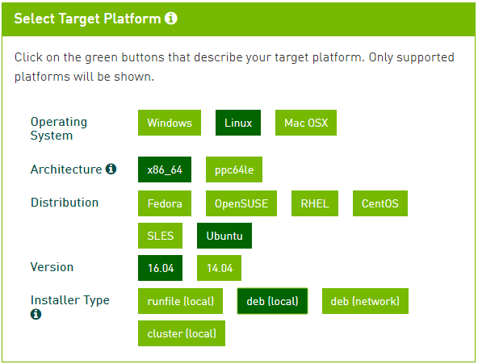
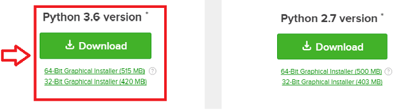

# Introduction
The aim of this tutorial is to explain how to install __Tensorflow__ library "step by step" and on different operating systems. Tensorflow is a python library. Similar to many others, we tried installing many side packages and libraries and experienced lots of problems and errors. We finally came up with a general solution and recommend installing the following libraries and packages as the __best way__ around it:

##### * (optional) __CUDA-toolkit__ & __cuDNN__ library (to use GPU version of Tensorflow)

##### 1. Python programing language (to run your code)

##### 2. Anaconda package manager (to create environments for managing the proper version of python and libraries)

##### 3. Tensorflow library (guess why?)

##### 4. Integrated Development Environment or IDE in short (to write, test and debug your code in an easier way)
While installing some of these are not mandatory (like Anaconda), having them installed makes your life easier in the long run. The detailed explanations and instructions are provided in this tutorial where we install:

##### * (For GPU version) CUDA 9 & cuDNN 7 (since it is compatible with Tensorflow 1.5)
##### 1. Python 3.5 via Anaconda
##### 2. Anaconda distribution
##### 3. Tensorflow 1.5
##### 4. PyCharm
 


## (Only for GPU version) CUDA & cuDNN:
You only need to read this section, if you have a GPU on your system. Otherwise, ignore it and jump to the next section.

If you want to use the __GPU version__ of the __Tensorflow__ you must have a __cuda-enabled GPU__.

* To check if your GPU is CUDA-enabled, try to find its name in the long [list of CUDA-enabled GPUs](https://developer.nvidia.com/cuda-gpus).
* To verify you have a CUDA-capable GPU:
  * __(for Windows)__ Open the command prompt (click start and write “cmd” on search bar) and type the following command:
  ```bash
  control /name Microsoft.DeviceManager 
  ```
  * __(for Linux)__ Open terminal (Alt+Ctrl+T) and type:
  ```bash
  lspci | grep -i nvidia 
  ```

__1.__ Download and install the CUDA toolkit 9.0 from https://developer.nvidia.com/cuda-90-download-archive. Choose the correct version of your operating system:

__(for Windows):__ Choose the correct version of your windows and select local installer:


Install the toolkit from downloaded .exe file.

__(for Linux):__ Choose the correct version of your Linux and select deb local installer:
 

Open terminal and type:
```bash
sudo apt-get install synaptic 
synaptic <package_name>.deb 
```
 __*Note:__ install on default path because you have to add the path as a variable:
```bash
Export LD_LIBRARY_PATH=$LD_LIBRARY_PATH:/usr/local/lib 
```
__2.__ Download the cuDNN v7.0.5 (CUDA for Deep Neural Networks) library from [here](https://developer.nvidia.com/cudnn).
It will ask for setting up an account … (it is free)
Download cuDNN v7.0.5 for CUDA 9.0

__(for Windows):__ Choose the correct version of your Windows. Download the file. Copy the files to “C:\Program FIles\NVIDIA GPU Computing Toolkit\CUDA\v9.0” in the corresponding folders:

 

__(for Linux):__ Choose the correct version of your Linux. Download the file. Go to the folder that you downloaded the file and open terminal and type:

synaptic  <library_name>.deb 
Install libcupti-dev:
```bash
sudo apt-get install libcupti-dev 
 ```


## 1. Python programming language:
In order to run __Python__ codes, you need to install Python. Python comes pre-installed with most Linux and Mac distributions. However, here we will install the python via __Anaconda__ distribution because it gives the flexibility to create __multiple environments__ for different versions of python and libraries. __Tensorflow currently runs only with python 3.5 on windows__. We will use Python 3.5 for all operating systems (Windows, Linux, and Mac) to keep it uniform among OSs throughout the tutorial.

In case you are interested, [this](https://www.youtube.com/watch?v=oVp1vrfL_w4&feature=youtu.be) video explains why python 3. It also clearly explains the differences between Python 2 and 3.

 

## 2. Anaconda:
Anaconda gives you the ability to __create multiple environments__ with different versions of Python and other libraries. This becomes useful when some codes are written with specific versions of a library. For example, you define your default Tensorflow environment with python 3.5 and Tensorflow 1.5. However, you may find another code that runs in python2.7 and has some functions that work with Tensorflow 1.2. You can easily create a new environment and don’t mess with your default environment. The figure below might give you some hints:

 


To install the Anaconda follow these steps:

1. Download the installer from [here](https://www.anaconda.com/download/).

2. Select the proper operating system.

     

3. Download the python 3.6 installer:

     

4. Follow the instructions on installation in [here](https://docs.anaconda.com/anaconda/install/).

    __*Note:__ remember the path that you are installing the Anaconda into. You will later need it for setting the path in PyCharm (we'll dive into it soon).

    __(For Windows):__ Make sure to select "Add Anaconda to my PATH environment variable".

     
  

 
__*Note:__ If you wanna learn more about Anaconda, watch [this](https://www.youtube.com/watch?v=YJC6ldI3hWk) amazing video which explains it thoroughly.

## 3. Tensorflow:
Now, having installed all the prerequisites, you can start installing the __Tensorflow__ library. To install the library we will create an environment in Anaconda with __python 3.5__ we name it __tensorflow__. However, you may choose your own desired name for it. Open command prompt (or terminal) and type:
```bash
conda create --name tensorflow python=3.5 
```
Once the environment is created, we can activate the environment:

__(for Windows):__
```bash
activate tensorflow 
```
__(for Linux & Mac):__
```
source activate tensorflow 
```
At this step, the name of the environment will appear at the beginning of the line. such as:
```bash
(tensorflow) >> 
```
Now you can go ahead and install the Tensorflow:

__(for Windows):__

*(CPU version):*
```bash
pip install --upgrade tensorflow 
```
*(GPU version):*
```bash
pip install --upgrade tensorflow-gpu 
```
__(for Linux):__

*(CPU version):*
```bash
pip install --ignore-installed --upgrade https://storage.googleapis.com/tensorflow/linux/cpu/tensorflow-1.5.0-cp35-cp35m-linux_x86_64.whl
```
*(GPU version):*
```bash
pip install --ignore-installed --upgrade https://storage.googleapis.com/tensorflow/linux/gpu/tensorflow_gpu-1.5.0-cp27-none-linux_x86_64.whl 
 ```
__(for Mac):__

*(CPU version):*
```bash
pip install --ignore-installed --upgrade https://storage.googleapis.com/tensorflow/mac/cpu/tensorflow-1.5.0-py2-none-any.whl 
```
## 4. Pycharm:
Now that the Tensorflow is installed in your machine. You can start coding. You can write your codes in any editor (terminal, emacs, notepad, ...). We suggest using __Pycharm__ because it offers a powerful debugging tool which is very useful especially when you write codes in Tensorflow. The community version of this software is free and you can download it through https://www.jetbrains.com/pycharm/download/.

After you download and install the PyCharm, there is one last thing that you need to do. You have to show the PyCharm that where is the location of the python file that you have installed your tensorflow environment. You can do so through the interpreter section. When you have an existing project opened (if not, create a new project), go to the preferences. In project section, select the project interpreter and specify the path to the environment.

 

Now you are all set. Write a short program like the following and run it to check everything is working fine:
```python
import tensorflow as tf
a = tf.constant(2)
with tf.Session() as sess:
   print(sess.run(a)) 
```
```
2 
```
It must print out the value of a, 2.


Thanks for reading! If you have any question or doubt, feel free to leave a comment in our [website](http://easy-tensorflow.com/).