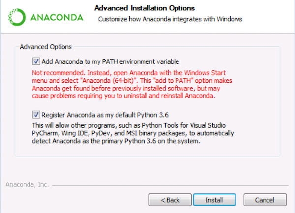
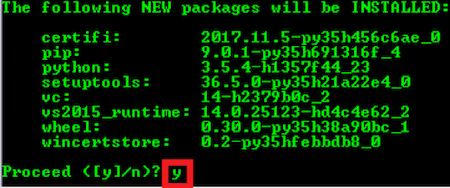

# Installing Tensorflow with CPU for Windows

## Requirements

* Python 3.5

## 1. Install Anaconda

The first thing you need to install the Tensorflow is to have the Anaconda distribution which handles the installation of python itself and the dependencies (libraries, etc.).

 1. Download the installer from https://www.anaconda.com/download
 2. Select the proper operating system

    

 3. Download the python 3.6 installer:

    

 4. Follow the instructions on installation from https://docs.anaconda.com/anaconda/install/
    * Make sure to add Anaconda to my PATH environment variable.

    

## 2. Create Anaconda Environment:

One of the reason that we installed Anaconda is that (on Windows) we need python 3.5 to install the Tensorflow. So, go ahead and create an environment with python 3.5:
  1. Open command prompt 
  2. Create a new environment:

  `conda create -n tensorflow python=3.5`

  3. It will ask for installing new packages. Insert “y”.

      

## 3. Install Tensorflow:
Now that we have created the environment, we should activate it:

  `acativate tensorflow`

  * In this case your name of environment (which we named it tensorflow) will show in the beginning of the line.
  

Now that the environment is activated we can go ahead and install the tensorflow:

`pip install --ignore-installed --upgrade tensorflow`

### Notes:
Always activate the environment before launching any editor.

`activate tensorflow`

There are some useful packages that we highly suggest to install:

`pip install matplotlib jupyter pillow`

	
