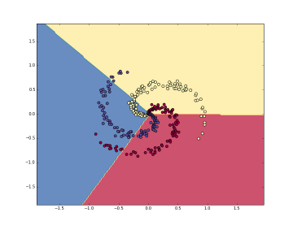

# Linear Classifier (Logistic Regression)

In this tutorial, we'll implement a Linear Classifier (i.e. Logistic Regression) to classify the MNIST data. 

The __logistic regression__ is called as a __linear classifier__ because 
it produces a decision boundary which is linear in nature. 
So, the classification made by a logistic regression is linear only.
Figure below shows the structure of the classifier implemented for classifying the 28x28 MNIST data (i.e. images of hand-written digits).

___Fig. 1-___ Sample Logistic Regression structure implemented for classifying MNIST digits

Example of decision boundaries generated for separating 3 classes are illustrated below.

 ___Fig. 2-___ Decision boundries generate by a linear classifier
 
 To learn more about the Logistic Regression, read [this](https://cs231n.github.io/linear-classify/) article.
 
 ## Tutorials
 
 * [1. Logistic Regression](https://github.com/easy-tensorflow/easy-tensorflow/blob/master/1_TensorFlow_Basics/Tutorials/1_Graph_and_Session.ipynb)
    Implemented in TensorFlow 
* [2. Logistic Regression+TensorBoard](https://github.com/easy-tensorflow/easy-tensorflow/blob/master/1_TensorFlow_Basics/Tutorials/2_Tensor_Types.ipynb)
    Monitoring the classifier structure, learning and performance of the implemented classifier using TensorBoard