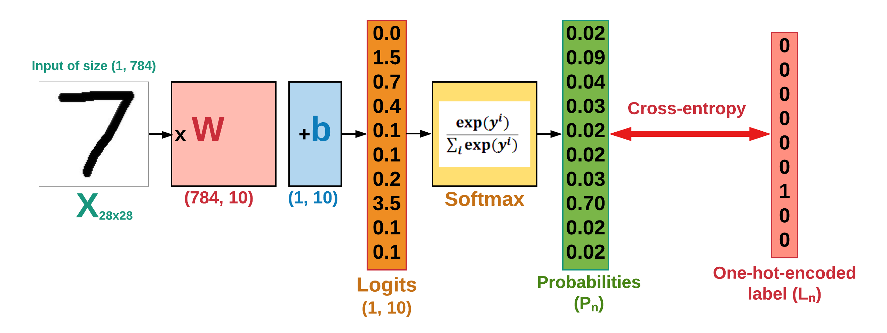

# Linear Classifier (Logistic Regression)

In this tutorial, we'll implement a Linear Classifier (i.e. Logistic Regression) to classify the MNIST data. You can read our step-by-step [Tutorial](https://github.com/easy-tensorflow/easy-tensorflow/blob/master/2_Linear_Classifier/Tutorials/1_Linear_Classifier.ipynb) on writing the code for this network, or skip it and see the implementation [Code](https://github.com/easy-tensorflow/easy-tensorflow/tree/master/2_Linear_Classifier/code).

It's called __linear classifier__ because it produces decision boundaries which are linear in nature. So, the classification made by this classifier is linear only.
Figure below shows the structure of the classifier implemented for classifying the 28x28 MNIST data (i.e. images of hand-written digits).

___Fig. 1-___ Structure of a linear classifier implemented for classifying MNIST digits

Example of decision boundaries generated for separating 3 classes are illustrated below.

  

 ___Fig. 2-___ Decision boundries generate by a linear classifier
 
 To learn more about the Logistic Regression, read [this](https://cs231n.github.io/linear-classify/) article.
 
 ## Tutorials
 
 * [1. Linear Classifier](https://github.com/easy-tensorflow/easy-tensorflow/blob/master/2_Linear_Classifier/Tutorials/1_Linear_Classifier.ipynb)
    Implemented in TensorFlow 
* [2. Linear Classifier+TensorBoard](https://github.com/easy-tensorflow/easy-tensorflow/blob/master/2_Linear_Classifier/Tutorials/2_Linear_Classifier%20_TensorBoard.ipynb)
    Visualizing the classifier structure, learning process and performance using TensorBoard
