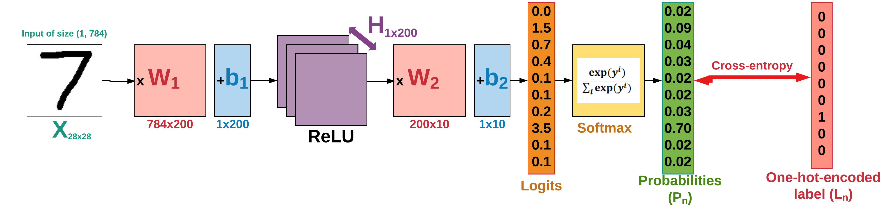

# Neural Network

## Introduction

In this tutorial, we'll create our first neural network classifier in Tensorflow. The implemented network architecture is presented in the following figure. You can read our step-by-step [Tutorial](https://github.com/easy-tensorflow/easy-tensorflow/blob/master/3_Neural_Network/Tutorials/1_Neural_Network.ipynb) on writing the code for this network, or skip it and see the implementation [Code](https://github.com/easy-tensorflow/easy-tensorflow/tree/master/3_Neural_Network/code).

___Fig. 1-___ Sample Neural Network architecture with two layers implemented for classifying MNIST digits

In the previous tutorial on the [Linear Classifier](https://cs231n.github.io/linear-classify/), we saw that the decision boundaries generated by them to separate classes are linear! This is very limiting and performs poor when it comes to non-linearly separable data points. This gives rise to the idea of __Neural Networks__ which is like using stacks of linear classifiers linked to each other by a non-linearity (ReLU in Fig. 1). To learn more about this, read  [this](https://cs231n.github.io/neural-networks-case-study/) article.

  

 ___Fig. 2-___ Sample decision boundries generate by: (a) linear classifier, (b) neural network.
 
 
 To learn more about the Logistic Regression, read [this](https://cs231n.github.io/linear-classify/) and for a detailed tutorial on the basics of neural networks, see the following links:
 
 [Neural Networks Part 1: Setting up the Architecture](https://cs231n.github.io/neural-networks-1/)
 
 [Neural Networks Part 2: Setting up the Data and the Loss](https://cs231n.github.io/neural-networks-2/)
 
 [Neural Networks Part 3: Learning and Evaluation](https://cs231n.github.io/neural-networks-3/)
 
 
 ## Tutorials
 
 * [1. Neural Network](https://github.com/easy-tensorflow/easy-tensorflow/blob/master/3_Neural_Network/Tutorials/1_Neural_Network.ipynb)
    A two-layer neural network classifier for classifying MNIST data implemented in TensorFlow 
* [2. Neural_Network+TensorBoard](https://github.com/easy-tensorflow/easy-tensorflow/blob/master/2_Linear_Classifier/Tutorials/2_Neural_Network_TensorBoard.ipynb)
    Visualizing the classifier structure, learning process and performance using TensorBoard
