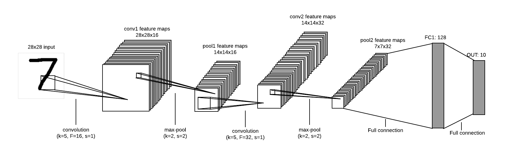

# Tutorial\#05: Convolutional Neural Networks (CNNs)

## Introduction

In this tutorial we will implement a simple Convolutional Neural Network in TensorFlow
with two convolutional layers, followed by two fully-connected layers at the end. 
The network structure is shown in the following figure and has classification accuracy of
above 99% on MNIST data.

*Fig1. CNN structure used for digit recognition*

## Dependencies
- Python (2.7 preferably; also works fine with python 3)
- NumPy
- [Tensorflow](https://github.com/tensorflow/tensorflow)>=1.1
- Matplotlib (for plotting images)

## References:
* [www.tensorflow.com](www.tensorflow.com)
* [Visualizing a Trained Autoencoder](http://ufldl.stanford.edu/wiki/index.php/Visualizing_a_Trained_Autoencoder)
