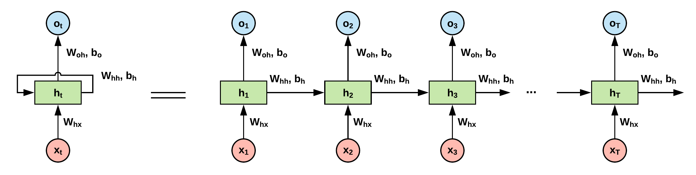

# Recurrent Neural Networks (RNNs)

## Introduction:

In this tutorial we will learn about implementing Recurrent Neural Network in TensorFlow. 
RNN's charactristics makes it suitable for many different tasks; from simple classification to machine translation, language modelling, sentiment analysis, etc.

___Fig. 1-___ Sample RNN structure (Left) and its unfolded representation (Right)

In this series of tutorials, our goal is __not__ to teach how RNNs work, but to see how to implement them in TensorFlow. So if you are not familiar with the basics of RNN, LSTM, Bidirectional RNN, etc., we suggest you follow the following links before reading our tutorial:

- [Introduction to RNNs](http://www.wildml.com/2015/09/recurrent-neural-networks-tutorial-part-1-introduction-to-rnns/)
- [Understanding the Backpropagation Through Time (BPTT) algorithm and the vanishing gradient problem](http://www.wildml.com/2015/09/recurrent-neural-networks-tutorial-part-1-introduction-to-rnns/)
- [Understanding LSTM Networks](https://colah.github.io/posts/2015-08-Understanding-LSTMs/)

## Tutorials:

We strongly suggest you to follow our tutorials one after the other; especially start by reading the first tutorial where we explain the notations that we are going to use through out this series:

- [Notations](https://github.com/easy-tensorflow/easy-tensorflow/blob/master/7_Recurrent_Neural_Network/Tutorials/01_Notations.ipynb)
- [Many to One with Fixed Sequence Length](https://github.com/easy-tensorflow/easy-tensorflow/blob/master/7_Recurrent_Neural_Network/Tutorials/03_Many_to_One_with_Fixed_Sequence_Length.ipynb)
- [Vanilla RNN for Digit Classification](https://github.com/easy-tensorflow/easy-tensorflow/blob/master/7_Recurrent_Neural_Network/Tutorials/06_Vanilla_RNN_for_Classification.ipynb)

- [Bidirectional RNN for Digit Classification](https://github.com/easy-tensorflow/easy-tensorflow/blob/master/7_Recurrent_Neural_Network/Tutorials/07_Bidirectional_RNN_for_Classification.ipynb)

## References:
* [www.tensorflow.com](www.tensorflow.com)
