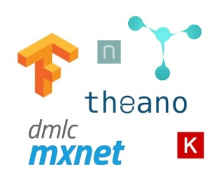

********************
Easy-TensorFlow
********************

.. image:: https://img.shields.io/badge/contributions-welcome-brightgreen.svg?style=flat
    :target: https://github.com/easy-tensorflow/easy-tensorflow/pulls
.. image:: https://img.shields.io/website-up-down-green-red/http/shields.io.svg
     :target: http://www.easy-tensorflow.com/
.. image:: https://img.shields.io/badge/Made%20with-Python-1f425f.svg
      :target: https://www.python.org/
.. image:: https://img.shields.io/pypi/l/ansicolortags.svg
      :target: https://pypi.python.org/pypi/ansicolortags/
.. image:: https://img.shields.io/github/contributors/Naereen/StrapDown.js.svg
      :target: https://github.com/easy-tensorflow/easy-tensorflow/graphs/contributors
.. image:: https://img.shields.io/github/issues/Naereen/StrapDown.js.svg
      :target: https://github.com/easy-tensorflow/easy-tensorflow/issues

The goal of this repository is to provide comprehensive tutorials for TensorFlow while maintaining the simplicity of the code.

Each tutorial includes a **detailed explanation** (written in .ipynb) format, as well as the **source code** (in .py format).

#################
Table of Contents
#################
.. contents::
  :local:
  :depth: 3

============
Motivation
============

There is a necessity to address the motivations for this project. TensorFlow is one of the deep learning frameworks available with the largest community.
This repository is dedicated to suggesting a simple path to learn TensorFlow.

~~~~~~~~~~~~~~~~~~~~~
Why use TensorFlow?
~~~~~~~~~~~~~~~~~~~~~

We can summarize the **pros** as below:

    - It’s developed and maintained by Google. As such, a continued support and development is ensured
    - Very large and active community
    - Low-level and high-level interfaces to network training
    - Tensorboard is the powerful visualization suite which is developed to track both the network topology and performance, making debugging even simpler.
    - Written in Python (even though some parts crucial for performance is implemented in C++) which is a very attractive language to read and develop in
    - Multiple GPUs support. So you can freely run the code on different machines without having to stop or restart the program
    - Faster model compilation than Theano-based options
    - Faster compile times than Theano
    - Is about more than deep learning. TensorFlow actually has tools to support reinforcement learning and other algorithms.

In addition to the aforementioned points, the large community of TensorFlow enrich the developers with the answer to almost all the
questions one may encounter. Furthermore, since most of the developers are using TensorFlow for code development, having a hands-on on TensorFlow is a necessity these days.

~~~~~~~~~~~~~~~~~~~~~~~~~~~~~~~~~~~~
Why this repository?
~~~~~~~~~~~~~~~~~~~~~~~~~~~~~~~~~~~~

In most of the available projects on the web, one of the below issues exists:

 - There is no or very limited explanation of what is happening in the code.
 - Different parts are not connected in a meaningful way.
 - The code implementation is too vague or complicated.
 - The focus is on either advanced or elementary level of Tensorflow implementation.

In this project, we tried to connect parts from easy to advanced with detailed tutorials while keeping the code implementation
as simple as possible.

=================================================
TensorFlow Installation and Setup the Environment
=================================================

The aim here is to explain how to install TensorFlow library "step by step" and on
different operating systems. TensorFlow is a python library. Similar to many others, we tried
installing many side packages and libraries and experienced lots of problems and errors.

In order to install TensorFlow please refer to the following link:

.. _TensorFlow Installation: http://easy-tensorflow.com/tf-tutorials/basics/install

* `TensorFlow Installation`_

====================
TensorFlow Tutorials
====================

The tutorials in this repository are partitioned into relevant categories.

==========================

.. +----+---------------------+----------------------------------------------------------------------------------------+----------------------------------------------+
.. | #  |       topic         |   Source Code                                                                          |                                              |
.. +====+=====================+========================================================================================+==============================================+
.. | 1  | Start-up            | `Welcome <welcomesourcecode_>`_  / `IPython <ipythonwelcome_>`_                        |  `Documentation <Documentationcnnwelcome_>`_ |
.. +----+---------------------+----------------------------------------------------------------------------------------+----------------------------------------------+

.. _Installation: https://github.com/easy-tensorflow/easy-tensorflow/tree/master/0_Setup_TensorFlow
.. _Basics: https://github.com/easy-tensorflow/easy-tensorflow/tree/master/1_TensorFlow_Basics
.. _Logistic_Regression: https://github.com/easy-tensorflow/easy-tensorflow/tree/master/2_Linear_Classifier
.. _Feed_Forward_Neural_Network: https://github.com/easy-tensorflow/easy-tensorflow/tree/master/3_Neural_Network
.. _Tensorboard: https://github.com/easy-tensorflow/easy-tensorflow/tree/master/4_Tensorboard
.. _AutoEncoder: https://github.com/easy-tensorflow/easy-tensorflow/tree/master/5_AutoEncoder
.. _Convolutional_Neural_Network: https://github.com/easy-tensorflow/easy-tensorflow/tree/master/6_Convolutional_Neural_Network

+----+-----------------------------+----------------------------------------------------------------------------------------+
| #  |       topic                 |                                                                                        |
+====+=============================+========================================================================================+
| 0  | Installation                | `Code <Installation_>`_                                                                |
+----+-----------------------------+----------------------------------------------------------------------------------------+
| 1  | Basics                      | `Code <Basics_>`_                                                                      |
+----+-----------------------------+----------------------------------------------------------------------------------------+
| 2  | Logistic_Regression         | `Code <Logistic_Regression_>`_                                                         |
+----+-----------------------------+----------------------------------------------------------------------------------------+
| 3  | Feed_Forward_Neural_Network | `Code <Feed_Forward_Neural_Network_>`_                                                 |
+----+-----------------------------+----------------------------------------------------------------------------------------+
| 4  | Tensorboard                 | `Code <Tensorboard_>`_                                                                 |
+----+-----------------------------+----------------------------------------------------------------------------------------+
| 5  | AutoEncoder                 | `Code <AutoEncoder_>`_                                                                 |
+----+-----------------------------+----------------------------------------------------------------------------------------+
| 6  | Convolutional_Neural_Network| `Code <Convolutional_Neural_Network_>`_                                                |
+----+-----------------------------+----------------------------------------------------------------------------------------+

=====================
Some Useful Tutorials
=====================

  * `TensorFlow World <https://github.com/astorfi/TensorFlow-World>`_ - Simple and ready-to-use tutorials for TensorFlow
  * `TensorFlow Examples <https://github.com/aymericdamien/TensorFlow-Examples>`_ - TensorFlow tutorials and code examples for beginners
  * `Sungjoon's TensorFlow-101 <https://github.com/sjchoi86/Tensorflow-101>`_ - TensorFlow tutorials written in Python with Jupyter Notebook
  * `Terry Um’s TensorFlow Exercises <https://github.com/terryum/TensorFlow_Exercises>`_ - Re-create the codes from other TensorFlow examples
  * `Classification on time series <https://github.com/guillaume-chevalier/LSTM-Human-Activity-Recognition>`_ - Recurrent Neural Network classification in TensorFlow with LSTM on cellphone sensor data

=============
Contributing
=============

When contributing to this repository, please first discuss the change you wish to make via issue,
email, or any other method with the owners of this repository before making a change. *For typos, please
do not create a pull request. Instead, declare them in issues or email the repository owner*.

Please note we have a code of conduct, please follow it in all your interactions with the project.

~~~~~~~~~~~~~~~~~~~~
Pull Request Process
~~~~~~~~~~~~~~~~~~~~

Please consider the following criterions in order to help us in a better way:

  * The pull request is mainly expected to be a code script suggestion or improvement.
  * A pull request related to non-code-script sections is expected to make a significant difference in the documentation. Otherwise, it is expected to be announced in the issues section.
  * Ensure any install or build dependencies are removed before the end of the layer when doing a build and creating a pull request.
  * Add comments with details of changes to the interface, this includes new environment variables, exposed ports, useful file locations and container parameters.
  * You may merge the Pull Request in once you have the sign-off of at least one other developer, or if you do not have permission to do that, you may request the owner to merge it for you if you believe all checks are passed.

~~~~~~~~~~~
Final Note
~~~~~~~~~~~

We are looking forward to your kind feedback. Please help us to improve this open source project and make our work better.
For contribution, please create a pull request and we will investigate it promptly. Once again, we appreciate
your kind feedback and elaborate code inspections.
